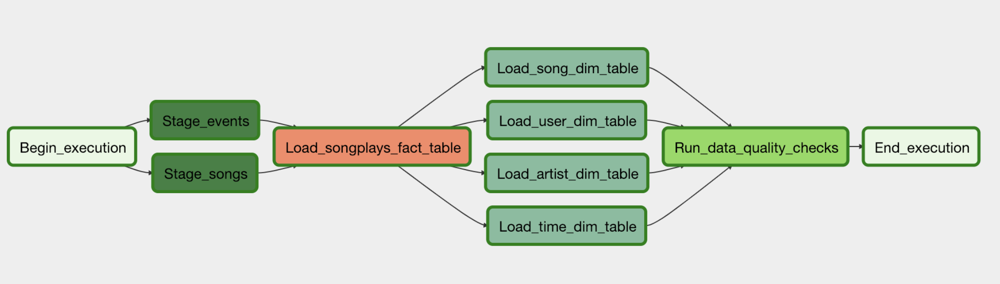

# Project: AWS Data Pipeline with Airflow

## Premise / Motivation
A music streaming company would like to implement additional automation and monitoring for their data warehouse ETL pipelines and have concluded that the best tool to achieve this is Apache Airflow. The company requires a high grade data pipeline that:
* is dynamic and built from reusable tasks
* can be monitored
* allows for easy backfills
* incorporates/executes quality test tasks after ETL steps are complete.

## Tools / Technologies
* Python, Apache Airflow, AWS IAM, S3, RedShift, SQL, Shell (Bash)

## Pipeline DAG Overview (Airflow UI)

## References
* Udacity Data Engineering with AWS cirriculum and starter files.
* Apache Airflow documentation.
* AWS documentation.

